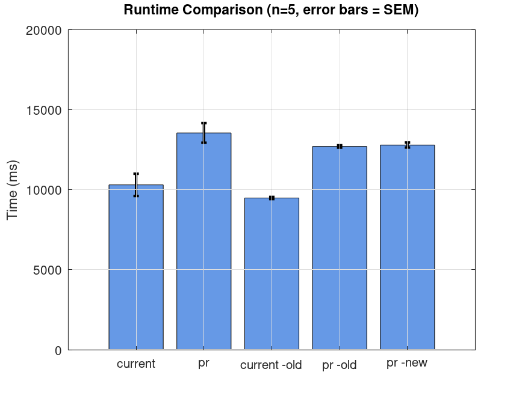

# Comparison between Antlr4 dev and https://github.com/antlr/antlr4/pull/4938

* Grammar: csharp/v8-spec (copied from https://github.com/antlr/grammars-v4/tree/05940d3505a22eb277eadbd28c92840c11d653cb/csharp/v8-spec).
* App generated by Trash trgen and substantially simplified to eliminate unnecessary features.
* Input: examples/*.cs
* N=5
* On AMD Ryzen 7 2700 Eight-Core Processor; 16GB DDR4; Samsung SSD 990 EVO Plus 2TB; Windows: Version 10.0.26200.7623.
* Dotnet 10.0.300

## Input stream construction per mode

| Mode | Input stream |
|---|---|
| (default) | `CharsetDetector.DetectFromFile(path)` → `CharStreams.fromPath(path, enc)` |
| `-old` | `new AntlrInputStream(new FileStream(path, FileMode.Open))` |
| `-new` (pr only) | `new CharSpanInputStream(new FileStream(path, FileMode.Open))` |

`-new` uses `CharSpanInputStream`, the new stream type introduced by the PR. `-old` uses the legacy `AntlrInputStream`. The default path auto-detects file encoding via `UtfUnknown.CharsetDetector` and then calls `CharStreams.fromPath`.

## Results

| | Mean (ms) | SEM (ms) |
|---|---|---|
| current | 10,302 | 695 |
| pr | 13,544 | 612 |
| current -old | 9,482 | 67 |
| pr -old | 12,699 | 73 |
| pr -new | 12,788 | 156 |

- **pr vs current** (default): 31.5% slower (3,242 ms difference)
- **pr -old vs current -old**: 33.9% slower (3,217 ms difference)
- **pr -new vs current -old**: 34.9% slower (3,306 ms difference)

None of the PR's code paths (default, `-old`, `-new`) recover the regression relative to the equivalent current baseline. The error bars do not overlap in any pairing, indicating clear and consistent regressions across all modes.

